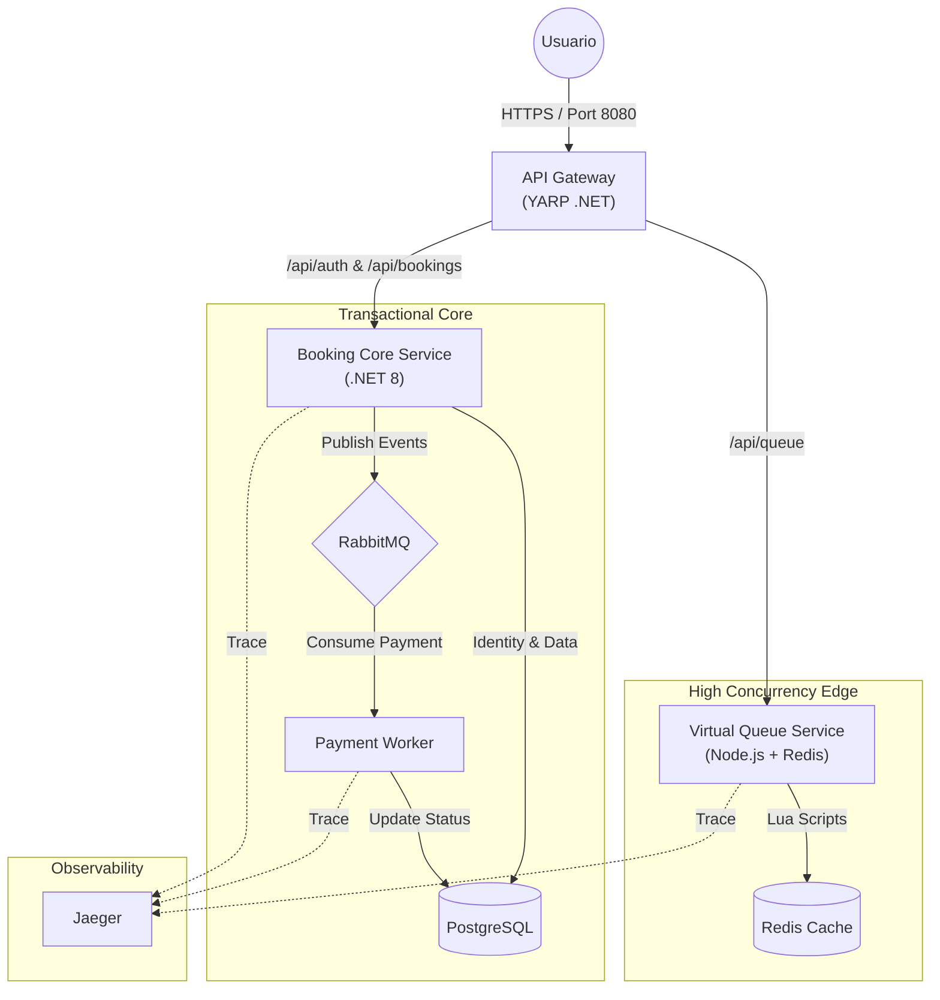

#  EventGrid: Sistema de Ticketing de Alta Concurrencia

[](https://github.com/ThomasZavalia/EventGrid/actions)


**EventGrid** es una solución de arquitectura distribuida diseñada para soportar la venta masiva de entradas bajo condiciones de tráfico extremo (ej. lanzamientos tipo Taylor Swift/Coldplay).

A diferencia de un CRUD tradicional, este sistema implementa un **Virtual Waiting Room** (Sala de Espera Virtual) para proteger el núcleo transaccional, garantizando **Zero-Overbooking** y alta disponibilidad.

##  Arquitectura del Sistema

El sistema utiliza una arquitectura híbrida orquestada por un **API Gateway (YARP)** que enruta el tráfico según la responsabilidad del microservicio:



##  Stack Tecnológico

### Backend Core
- **.NET 10 (C#)**: Servicio de Reservas, Identidad y Pagos
- **Node.js (TypeScript)**: Servicio de Cola Virtual de alto rendimiento (I/O Non-blocking)
- **Clean Architecture**: Separación estricta en Domain, Application, Infrastructure y API

### Datos & Mensajería
- **PostgreSQL**: Base de datos relacional con manejo de concurrencia optimista (xmin)
- **Redis**: Cache distribuido y Locking para la cola de espera
- **RabbitMQ (MassTransit)**: Desacoplamiento de procesos pesados (Pagos)

### Infraestructura & DevOps
- **Docker & Docker Compose**: Orquestación de contenedores
- **YARP (Reverse Proxy)**: API Gateway unificado
- **GitHub Actions**: CI Pipeline para Tests Unitarios y Build Checks
- **Jaeger / OpenTelemetry**: Trazabilidad distribuida para monitoreo de latencia

##  Características Clave

### Virtual Waiting Room
- Implementación de algoritmo **Leaky Bucket** para dosificar el tráfico hacia el Core
- Uso de **Distributed Locking (Redlock)** en Redis para asignar turnos atómicos

### Seguridad Zero-Trust
- Autenticación centralizada con **ASP.NET Core Identity**
- Validación estricta de **JWT (JSON Web Tokens)**
- API Gateway oculta la topología interna de la red

### Consistencia de Datos
- Manejo de **Concurrencia Optimista** para evitar la sobreventa de asientos sin bloquear la base de datos
- **Unit Testing (xUnit)** cubriendo la lógica de dominio crítica

### Procesamiento Asíncrono
- Patrón **Publisher/Subscriber** para el flujo de pagos
- Resiliencia con políticas de **Retry** y manejo de fallos en la conexión a la DB

##  Quick Start (Instalación)

### Prerrequisitos
- Docker Desktop instalado y corriendo
- Git

### Pasos

1. **Clonar el repositorio:**
```bash
   git clone https://github.com/ThomasZavalia/EventGrid.git
   cd EventGrid
```

2. **Configurar Entorno:**
   
   Crea un archivo `.env` en la raíz (opcional, docker-compose tiene defaults):
```env
   JWT_SECRET=tu_clave_super_secreta_de_al_menos_32_caracteres
```

3. **Levantar la Infraestructura:**
```bash
   docker-compose up --build
```
   Espera a que todos los servicios (Gateway, Postgres, Redis, RabbitMQ) estén "Healthy".

4. **Inicializar Datos (Seed):**
   
   Para crear un evento y asientos de prueba, envía una petición POST:
```bash
   curl -X POST http://localhost:8080/api/admin/seed
```

## 🧪 Testing

### Tests Unitarios (Lógica de Negocio)
El proyecto incluye una suite de pruebas automatizada con **xUnit** y **FluentAssertions**.
```bash
cd services/BookingService
dotnet test
```

### Tests de Estrés (Concurrencia)
Incluye un script para simular 50+ bots intentando comprar el mismo asiento simultáneamente.
```bash
cd tests/stress-test
npm install
node attack.js
```

**Resultado esperado:** Solo 1 compra exitosa, 49 rechazos controlados.

##  Endpoints Principales

Todos los endpoints están expuestos a través del Gateway en el puerto **8080**.

| Servicio | Método | Endpoint                      | Descripción                           |
|----------|--------|-------------------------------|---------------------------------------|
| Auth     | POST   | `/api/auth/register`          | Crear nuevo usuario                   |
| Auth     | POST   | `/api/auth/login`             | Obtener JWT                           |
| Queue    | POST   | `/api/queue/join`             | Unirse a la fila (Requiere Auth)      |
| Booking  | POST   | `/api/bookings/reserve`       | Reservar asiento (Requiere Auth + Turno) |
| Booking  | POST   | `/api/bookings/confirm-payment` | Pagar (Asíncrono)                   |

---

Desarrollado por **Thomas Zavalia** como demostración de arquitectura de software avanzada.
