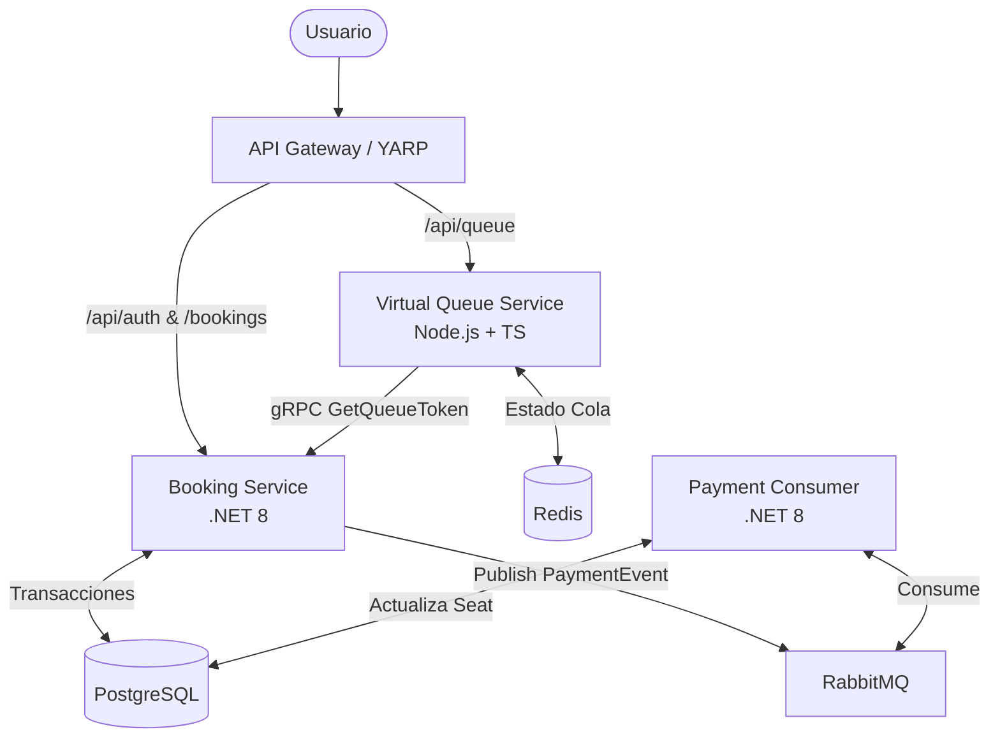

# EventGrid


Sistema distribuido de reserva de entradas diseñado para soportar alta concurrencia mediante un sistema de **Cola Virtual**.

La arquitectura divide la responsabilidad en microservicios, utilizando Node.js y Redis para el manejo ultra-rápido de la fila de espera, y .NET 8 con Entity Framework y MassTransit para garantizar la consistencia transaccional de los pagos y las reservas.

---

## Arquitectura


```mermaid
graph TD
    User([Usuario]) --> Gateway[API Gateway / YARP]
    
    Gateway -->|/api/queue| VQS[Virtual Queue Service<br/>Node.js + TS]
    Gateway -->|/api/auth & /bookings| BS[Booking Service<br/>.NET 8]
    
    VQS <-->|Estado Cola| Redis[(Redis)]
    VQS -->|gRPC GetQueueToken| BS
    
    BS <-->|Transacciones| Postgres[(PostgreSQL)]
    BS -->|Publish PaymentEvent| RMQ[RabbitMQ]
    
    Worker[Payment Consumer<br/>.NET 8] <-->|Consume| RMQ
    Worker <-->|Actualiza Seat| Postgres
```

### Componentes:
- **API Gateway (YARP)**: Punto de entrada único.
- **Virtual Queue Service**: Gestiona el acceso al sistema de reservas limitando la concurrencia. Emite tickets y devuelve un *QueuePass JWT* (vía gRPC) cuando es el turno del usuario.
- **Booking Service**: Emite JWTs, valida el acceso y orquesta la compra de asientos mediante la BD relacional y colas de mensajes.

---

## Instalación

### Requisitos previos
- Docker y Docker Compose instalados.

### Despliegue
Todo el entorno se orquesta automáticamente con Docker Compose:

```bash
git clone https://github.com/ThomasZavalia/EventGrid.git
cd EventGrid

# Levantar todos los servicios, bases de datos y brokers
docker-compose up -d --build
```

El API Gateway estará disponible en `http://localhost:8080`.

---

## Uso (API REST)

Aquí tienes el flujo completo de reserva:

```bash
# 1. Registrar y loguear usuario
curl -X POST http://localhost:8080/api/auth/register \
  -H "Content-Type: application/json" \
  -d '{"email":"test@test.com","password":"Test123!","firstName":"Juan","lastName":"Perez"}'

curl -X POST http://localhost:8080/api/auth/login \
  -H "Content-Type: application/json" \
  -d '{"email":"test@test.com","password":"Test123!"}'
# -> Guarda el "id" y el "token"

# 2. Inicializar BD (requiere token de login)
curl -X POST http://localhost:8080/api/admin/seed \
  -H "Authorization: Bearer <LOGIN_TOKEN>"

# 3. Unirse a la Cola Virtual (usa tu ID de usuario)
curl -X POST http://localhost:8080/api/queue/join \
  -H "Content-Type: application/json" \
  -d '{"userId":"<TU_USER_ID>"}'
# -> Si es tu turno, recibirás un "accessToken" (QueuePass)

# 4. Reservar asiento (usa el QueuePass, no el login token)
curl -X POST http://localhost:8080/api/bookings/reserve \
  -H "Authorization: Bearer <QUEUE_PASS>" \
  -H "Content-Type: application/json" \
  -d '{"seatId":"<SEAT_ID>"}'

# 5. Confirmar pago (procesamiento asíncrono)
curl -X POST http://localhost:8080/api/bookings/confirm-payment \
  -H "Authorization: Bearer <QUEUE_PASS>" \
  -H "Content-Type: application/json" \
  -d '{"seatId":"<SEAT_ID>"}'
```

---

## Seguridad implementada

- **CORS dinámico**: Diferenciado entre Development (`AllowAll`) y Production (`AllowFrontend`).
- **Segregación JWT**: El token de Login (para identidad) no tiene permisos de reserva; solo el token emitido por la cola virtual (`is_queue_pass=true`) permite transaccionar.
- **Secretos**: Todas las credenciales críticas (Postgres, RabbitMQ, JWT Secret) se inyectan estrictamente por variables de entorno.

---

## Roadmap / Future Improvements

- [ ] **mTLS (Mutual TLS) interno**: Proteger el canal gRPC entre Node.js y .NET con certificados cliente/servidor.
- [ ] **Circuit Breaker**: Implementar *opossum* en el Virtual Queue Service para fallar rápido (Fail-Fast) si el BookingService experimenta latencia excesiva.
- [ ] **Redis Clustering**: Migrar el servidor Redis standalone a un cluster de alta disponibilidad y usar scripts Lua para el avance atómico de la cola.
